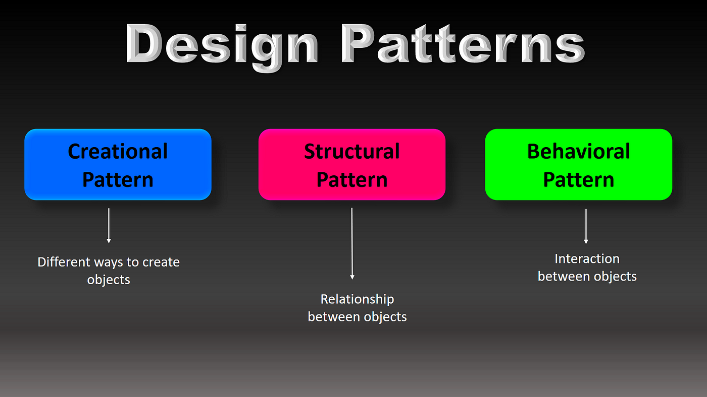

## The Role of Design Patterns in Software Engineering
In the world of software development, the journey from an idea to a fully functional application can feel like charting unknown territory. Without a map, developers risk reinventing the wheel—or worse, building solutions that are brittle, inefficient, or difficult to maintain. This is where design patterns come in. Design patterns are like well-worn paths in this vast landscape, offering proven, reusable solutions to common problems. They provide a shared language for developers, enabling teams to solve complex challenges collaboratively and with confidence.

Design patterns are not code themselves but templates for solving recurring design challenges. Much like architectural blueprints, they provide structure and guidance without dictating specific implementation details. Patterns like Singleton, Factory, and Observer serve as conceptual tools that developers can adapt to their specific needs. By following these patterns, teams can create systems that are more scalable, maintainable, and efficient. But design patterns aren’t just abstract ideas; their power lies in their application. To see how they shape real-world projects, let’s dive into a searchable dataset application built with React and Next.js, examining it through the lens of the Model-View-Controller (MVC) design pattern.

## The MVC Pattern
The Model-View-Controller (MVC) pattern is a cornerstone of software design, dividing an application into three interconnected parts:

  1. Model: Manages data and business logic.

  2. View: Handles the presentation layer, displaying data to the user.

  3. Controller: Mediates user input, updating the Model and determining what the View should display.

This separation of concerns promotes organization and flexibility, making it easier to manage complex applications. The searchable dataset page demonstrates MVC principles beautifully.

## Using MVC in Aloha Archives
For the 2024 Hawaii Annual Code Challenge and my final project for ICS 314, I was part of a team that redesigned the Hawaii Open Data Portal to be more user friendly and make finding data as easy as possible. I was tasked with creating the search bar and the results page for the website, which I used the MVC design pattern for.

  1. The Model is responsible for handling data and application logic. In this case, data includes topics, organizations, filtered results, and 
     user queries. Both parts use React’s state management (useState) and functions to manage and manipulate this data:

     Data Fetching: Functions like fetchTopics and fetchDatasets in ResultsPage.tsx retrieve data from an external API. They process the data and update the state, ensuring that the application’s data layer remains up-to-date.

     ```
     const fetchDatasets = async (query: string, topic: string, org: string, sort: string) => {
       const response = await fetch(`/api/datasets?search=${query}&topic=${topic}&org=${org}&sort=${sort}`);
       const data = await response.json();
       setFilteredResults(data);
     };
     ```

     The Model operates independently of how data is displayed or interacted with, ensuring a clear separation of concerns.

  2. The View is all about the user interface. It displays the data from the Model and updates in response to changes. Both SearchBar.tsx and 
     ResultsPage.tsx are heavily focused on the View.

     Rendering Components: SearchBar is a View component that provides an input field for user queries and ResultsPage displays datasets, filter options, and sorting controls.

     An example of this can be seen within the SearchBar component:

     ```
     return (
      <Container>
         <InputGroup>
         <Form.Control
            type="text"
            value={query}
            onChange={(e) => setQuery(e.target.value)}
            onKeyDown={handleEnterPress}
            placeholder="Search for datasets..."
         />
         <InputGroup.Text>
            <Button id="searchIcon" onClick={handleSearch}>
               <Search />
            </Button>
         </InputGroup.Text>
         </InputGroup>
      </Container>
     );
     ```

     The View ensures that the application remains visually engaging and user-friendly.

  3. The Controller connects the Model and the View, handling user input and coordinating updates. In these files, event-handling functions act 
     as the Controller.

     User Input Handling: Functions like handleSearch, handleTopicFilter, and handleSort interpret user actions, such as typing in the search bar or clicking on a filter.

     ```
     const handleSearch = (newQuery: string) => {
       setQuery(newQuery);
       fetchDatasets(newQuery, selectedTopic, selectedOrg, sortCriteria);
     };
     ```

     Updating the Model and View: The Controller updates state variables based on user actions, triggering API calls to fetch new data or filtering the existing dataset. This updated state automatically reflects in the View.

     URL Management: In addition to managing state, the Controller synchronizes the application’s state with the browser’s URL, ensuring the user’s actions are preserved even on refresh or navigation.

     The Controller orchestrates the interaction between the user, the data, and the interface.

## Why The MVC Design Pattern Approach Works
By implicitly following the MVC pattern:

  1. Separation of Concerns: Each part of the code handles a specific responsibility, making the system easier to understand and maintain.

  2. Scalability: Adding new features (e.g., a new filter or sorting option) is straightforward because the logic is modular.

  3. Reusability: Components like SearchBar and event handlers are reusable across other parts of the application.

These components demonstrate how the MVC design pattern can be used effectively in React applications, even if not explicitly stated. By organizing code this way, the application becomes more maintainable, flexible, and robust.

Aloha Archives: <a href="https://github.com/Aloha-Archives/aloha-archives"><i class="large github icon "></i>Aloha-Archives/aloha-archives</a>
