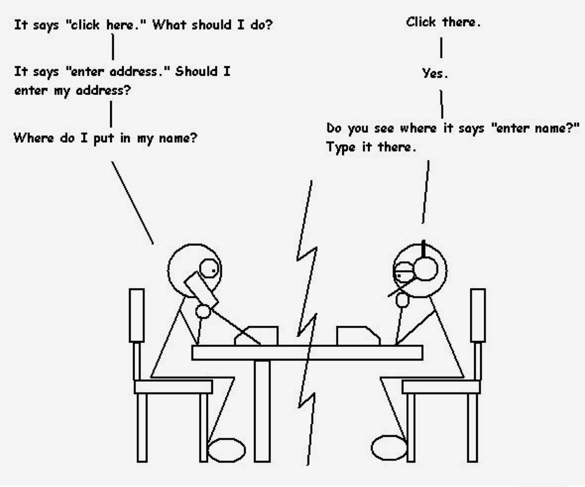

## What are Stupid Questions?
At some point in our lives, most of us have heard someone say, "There are no stupid questions." This is wrong. Some questions can be considered stupid because they often lack the characteristics of a smart question, which leads to wasted time and frustration. Attributes of a stupid question are typically 
```
1. Lack of Preparation: Stupid questions are frequently asked by individuals who have not invested time in preliminary research. Questions that could be answered with a simple search or a basic understanding of the topic indicate a lack of effort. For example, asking "What does the term 'open-source' mean?" in a technical forum where this concept is fundamental might be seen as a lazy approach.

2. Vagueness and Ambiguity: Stupid questions are often vague and do not provide enough information for others to give a useful response. Questions like "Why does this not work?" without any context or details fail to elicit meaningful help. Providing specific details about what is being attempted and the exact nature of the problem is crucial.

3. Irrelevance: Questions that are off-topic or irrelevant to the current discussion or forum can be perceived as stupid. For example, asking about the best way to cook pasta in a programming forum is not only irrelevant but also disruptive to the topic at hand.

4. Disrespectful or Demanding Tone: Questions that come across as rude, demanding, or entitled can alienate respondents. Statements like "You need to solve this problem for me" are not only unproductive but can also be perceived as disrespectful.
```

## How do you ask a Smart Question?


Source: <a href="https://stackoverflow.com/questions/1777914/java-need-to-create-pdf-from-byte-array"><i class="large github icon "></i>Smart Question</a>

## The foolproof way to get ignored.


Source: <a href="https://stackoverflow.com/questions/3905734/how-to-send-100-000-emails-weekly"><i class="large github icon "></i>Stupid Question</a>

## Conclusion

