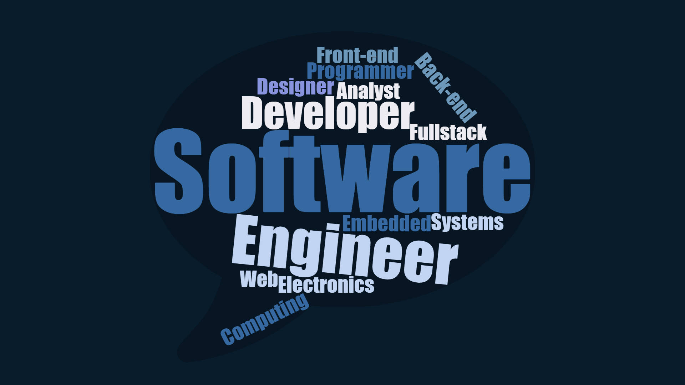

  

## Software Engineering Course
Software engineering is a diverse field encompassing many domains, each with unique challenges and opportunities. This course has provided a foundation in core principles like Open Source Software Development, Configuration Management, Functional Programming, Development Environments, Coding Standards, User Interface Frameworks, Agile Project Management, Design Patterns, and Ethics. While these topics were introduced in the context of web development, they are equally relevant to other areas of software engineering, including mobile development, embedded systems, data science, and distributed systems. Below, I discuss how these concepts extend to these domains.

## Open Source Software Development
Open Source Software Development fosters collaboration and innovation by making source code freely available. While it is common in web development (e.g., open-source web frameworks like React or Django), the approach is equally transformative in other software engineering fields.

In mobile development, open-source libraries like Flutter and React Native enable cross-platform app creation, accelerating development cycles. In embedded systems, communities like Arduino and Raspberry Pi share open hardware and software designs, encouraging experimentation and rapid prototyping. Open source empowers engineers in every domain to build on existing work rather than reinventing the wheel.

## Configuration Management
Configuration Management (CM) ensures consistency and reliability in software systems. While its role in web development often involves managing server environments or CI/CD pipelines, CM is equally vital in embedded systems, where hardware constraints necessitate precise versioning of firmware and dependencies.

In distributed systems, CM tools like Ansible or Kubernetes manage configurations across clusters of machines, ensuring consistent deployments. In mobile development, CM helps maintain consistency across a fragmented ecosystem of devices, operating systems, and screen resolutions. Across all domains, CM minimizes risks associated with scaling and collaboration.

## Functional Programming
Functional Programming (FP) emphasizes immutability and pure functions, promoting predictable and bug-free code. While FP is often associated with web development frameworks like Redux, its principles are particularly powerful in data science, where transformations on large datasets must remain deterministic.

In distributed systems, FP simplifies concurrency by avoiding shared mutable state, reducing the risk of race conditions. In mobile development, reactive programming libraries (e.g., RxJava for Android) leverage FP concepts to handle asynchronous events. The paradigm's focus on declarative logic makes it a valuable tool across varied software domains.

## Development Environments
Development environments streamline the coding process through tools like IDEs and debugging utilities. In web development, environments like Visual Studio Code and browser-based debuggers are standard. However, in embedded systems, environments like Keil or PlatformIO cater to low-level development, offering features like hardware emulators and memory analyzers.

In data science, environments such as Jupyter Notebooks or PyCharm specialize in handling data workflows and visualizations. For game development, tools like Unity or Unreal Engine integrate development and real-time rendering environments. Customizing environments to fit domain-specific needs ensures developers maximize productivity across all areas.

## Coding Standards
Coding standards ensure code is consistent, readable, and maintainable. While they are critical in web development to manage large teams and long-term projects, their importance is amplified in domains like safety-critical systems (e.g., automotive or aerospace software), where non-adherence to standards like MISRA can lead to catastrophic failures.

In mobile development, standards are essential for ensuring code works seamlessly across various devices and OS versions. Similarly, in data science, standards for documentation and reproducibility enable researchers to verify and build upon results. Coding standards create a universal language within teams and across software domains.

## User Interface Frameworks
User Interface (UI) Frameworks, such as React or Bootstrap, simplify creating web interfaces, but their principles are equally relevant in other domains. In mobile development, frameworks like SwiftUI and Jetpack Compose streamline the development of adaptive and responsive interfaces.

For game development, frameworks like Unity UI facilitate complex interactions in 3D environments. Even in embedded systems, UI libraries like LVGL are tailored for creating user interfaces on resource-constrained devices like smartwatches or medical devices. The idea of reusable components and standardized design applies universally to interface creation.

## Agile Project Management
Agile Project Management, particularly Issue Driven Project Management (IDPM), promotes adaptability and iterative progress. While often associated with web development, Agile methodologies excel in fields like game development, where rapid prototyping and frequent playtesting are integral to the process.

In data science, Agile ensures iterative exploration of hypotheses and models, incorporating stakeholder feedback into analysis cycles. For embedded systems, Agile adapts to evolving hardware requirements and testing constraints. The emphasis on iterative refinement and team collaboration makes Agile invaluable across diverse software engineering domains.

## Design Patterns
Design Patterns are reusable solutions to common software design problems. While web development benefits from patterns like Model-View-Controller (MVC) and Singleton, other fields have their own needs. For game development, patterns like Entity-Component-System (ECS) optimize performance in rendering and logic updates.

In embedded systems, patterns like State Machines are indispensable for managing device behavior. In distributed systems, patterns like Microservices or Circuit Breakers ensure resilience and scalability. Design patterns provide structure and consistency in solving domain-specific challenges.

## Ethics in Software Engineering
Ethics in Software Engineering encompasses privacy, fairness, and inclusivity. These concerns are evident in web development but take on heightened importance in other domains. For data science, ethics governs how algorithms handle sensitive data and avoid perpetuating biases.

In embedded systems, ethical concerns revolve around ensuring safety and reliability, especially in medical or automotive applications. For game development, ethical design addresses issues like addiction, microtransactions, and inclusivity. Ethics is a cornerstone of responsible software engineering across all fields.

## Conclusion
This course has demonstrated that the principles of software engineering are universal, transcending the boundaries of web development. Whether managing configurations in embedded systems, applying design patterns to distributed architectures, or addressing ethical concerns in data science, these concepts form the backbone of software engineering. Understanding their broader applications prepares me to contribute meaningfully to any domain, ensuring that the systems I build are robust, scalable, and responsible.
