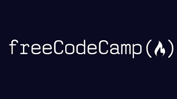

## Introduction to JavaScript

Before taking the FreeCodeCamp course to learn JavaScript and TypeScript, I knew little about how the JavaScript and TypeScript languages functioned. My prior experience in programming languages consisted of Java and Python. I learned Java in the introductory Computer Science courses at Arizona State University and the University of Hawai'i at Mānoa. Due to my experience with Java, learning JavaScript was not that hard. The FreeCodeCamp course taught me the necessary diction and syntax changes that I needed to make to adapt to writing code in JavaScript. The experience of learning JavaScript was fairly easy considering how similar the language is to Java.

## Learning TypeScript

After learning JavaScript, TypeScript was fairly easy to learn. TypeScript seemed like a more precise version of JavaScript. It makes more use of assigning types to variables and functions. This allows for the code to be easier to understand by displaying the intended function of each variable and function. I enjoyed learning TypeScript and believe that it will be very useful for a future career in software engineering due to the versatility of the language.

## TypeScript Playground

Essay Here.
