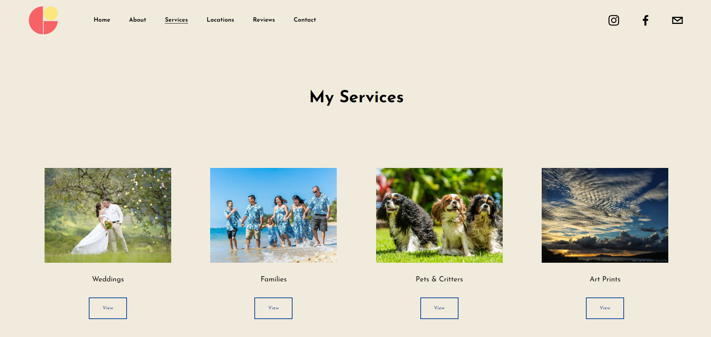
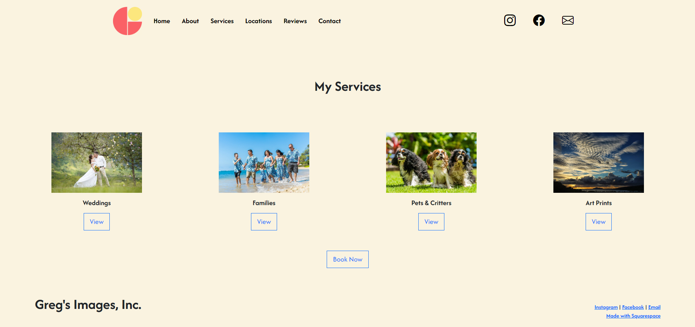

## Embracing Bootstrap 5: A Modern Approach to UI Development

In the constantly changing landscape of web development, UI frameworks have become vital tools for developers. Among these, Bootstrap 5 stands out due to its extensive features and capabilities. At first glance, UI frameworks can appear overwhelmingly complex. Bootstrap 5, for instance, introduces a multitude of components, utilities, and responsive design principles that require understanding. The challenge involves not just learning the syntax, but also understanding the framework’s core principles. This complexity can deter some developers, leading them to consider raw HTML and CSS as simpler alternatives. However, the apparent ease of using raw HTML and CSS can be misleading. Creating responsive and attractive interfaces without a framework takes a lot of custom code, which can be time-consuming and cause errors. Additionally, as a project's scope grows, it becomes more challenging to maintain and scale a hand-coded solution.

## The Advantages of Using Bootstrap 5

1. Accelerated Development: Bootstrap 5 significantly speeds up the development process by providing a comprehensive library of pre-designed components, such as buttons, forms, and navigation bars. This allows developers to quickly piece together user interfaces without the need to create elements from scratch, making it especially useful in fast-paced development environments.

2. Seamless Responsiveness: With its robust grid system and utility classes, Bootstrap 5 enables developers to create layouts that automatically adjust to various screen sizes. This ensures a consistent and optimal user experience across devices, a task that can be challenging with custom CSS alone.

3. Consistent Design Standards: Bootstrap 5 promotes consistent design across web applications by providing a set of predefined styles and components. This uniformity helps ensure that user interfaces look polished and professional, enhancing the overall user experience and making it easier for teams to collaborate on projects.

4. Customization and Modularity: While Bootstrap offers a default design, it is highly customizable. Developers can modify styles and components to match specific branding requirements, allowing for a unique look while maintaining the speed and efficiency the framework provides. Its modular structure means teams can implement only the elements they need, resulting in cleaner and more maintainable code.

## Personal Experience with Bootstrap 5

In my own experience with Bootstrap 5, I found the transition from raw HTML and CSS to be both enlightening and empowering. Initially, I was skeptical about the learning curve, but the structured approach Bootstrap offered quickly became apparent. I was able to recreate a professional-looking website that I had previously helped to design with Squarespace, but this time using Bootstrap 5. The grid system particularly stood out, allowing me to build a responsive layout with minimal effort. Also, Bootstrap’s extensive documentation and community support helped me overcome problems that would have otherwise stalled my progress. When I encountered issues, I found solutions quickly through forums or the official documentation, allowing me to focus on the creative aspects of web development rather than the technical details of browser compatibility. 

1. Website that I designed using Squarespace

2. Website that I built using Bootstrap 5

## Conclusion

While the complexity of UI frameworks like Bootstrap 5 may initially deter some developers, the substantial benefits they offer in terms of speed, responsiveness, and maintainability make them a worthwhile investment. The transition from raw HTML and CSS to a structured framework not only enhances development efficiency but also elevates the quality of the final product. For developers looking to build robust, user-friendly interfaces, embracing a framework like Bootstrap 5 can be a game-changer, transforming the way they approach web design and development. Ultimately, the choice between raw coding and using a UI framework should consider not just the immediate needs of a project but also long-term scalability and maintainability.