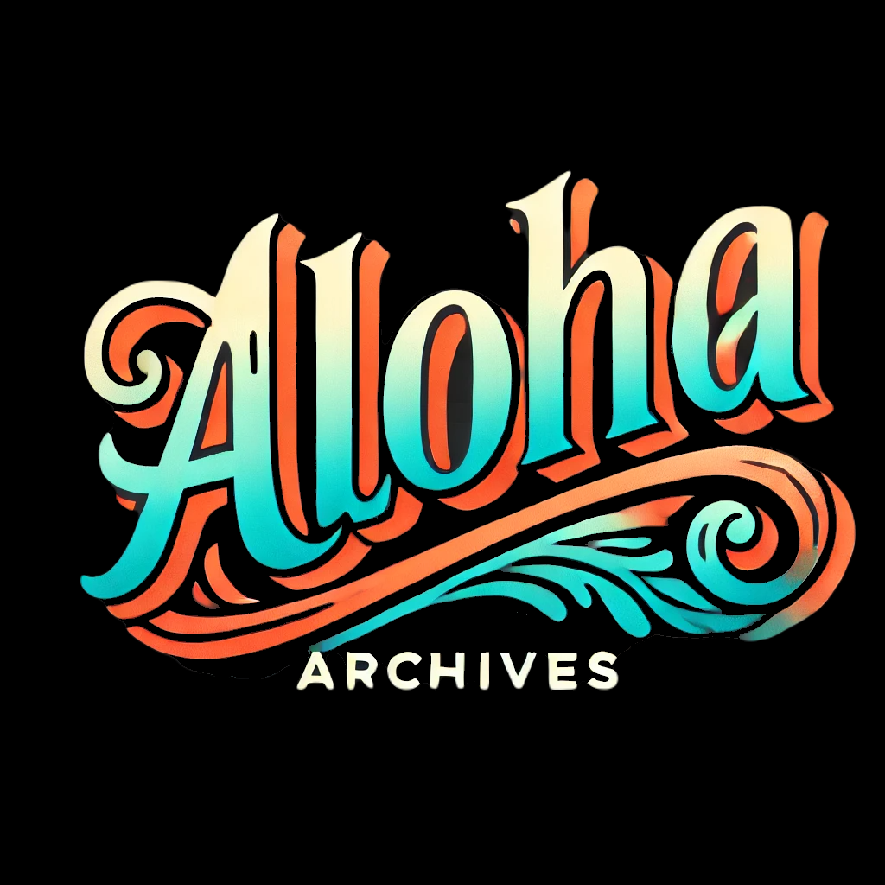
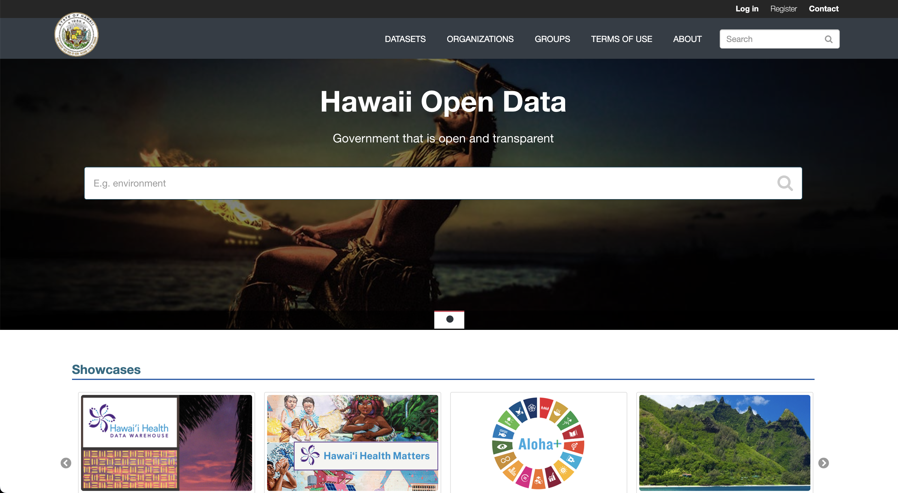
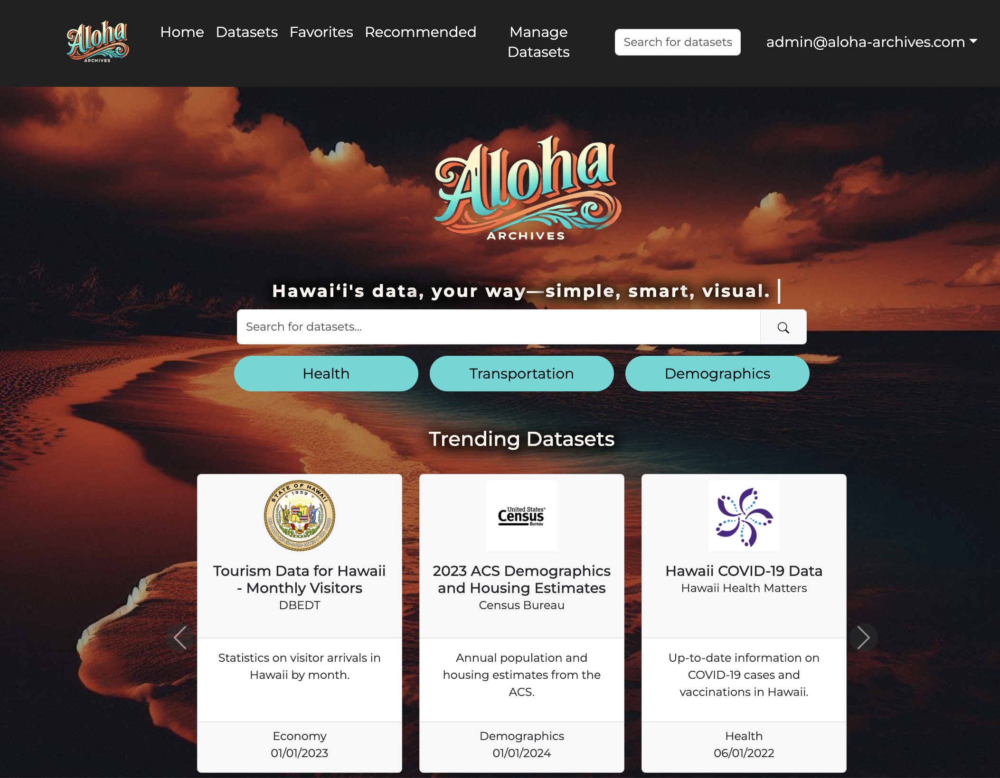
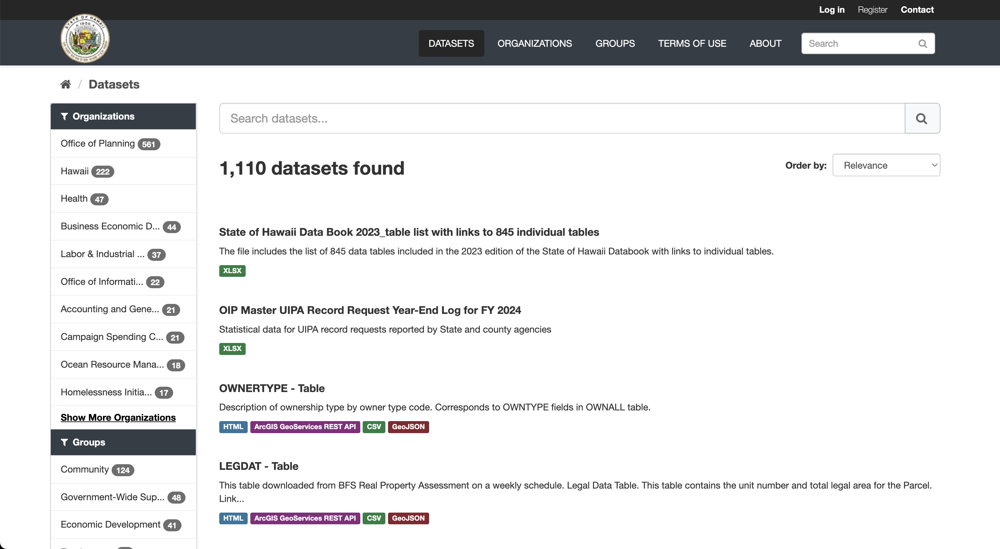
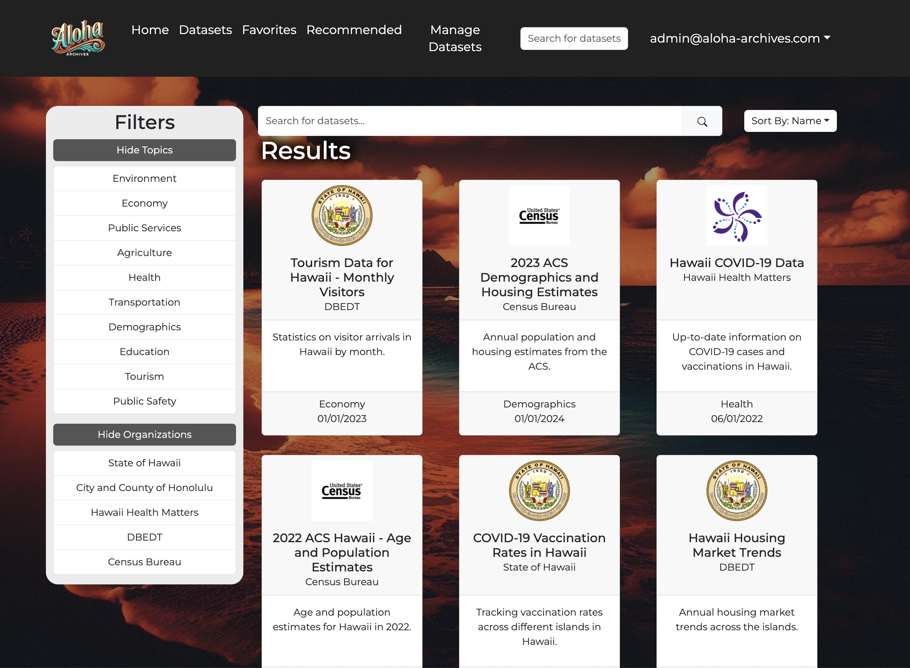

<div class="text-center p-4">
  
</div>

## Project Summary
The Aloha Archives project reimagines Hawai'i's Open Data Portal, addressing its limitations with an accessible, user-friendly, and visually engaging platform that empowers citizens and policymakers to explore and utilize government datasets effectively. By transforming Hawai'i's Open Data Portal into an engaging and accessible tool, Aloha Archives advances the state's goal of increasing transparency and fostering civic engagement.

## The Problem
The current Hawai'i Open Data Portal has several usability challenges:

1. Limited Accessibility: Data is available only in raw formats, making it difficult for non-technical users to engage.
2. Lack of Visualizations: Users struggle to interpret data due to the absence of interactive visual tools.
3. Inconsistent Organization: Variability in how datasets are grouped and tagged reduces discoverability.
4. Static User Experience: The interface does not cater to varying levels of digital literacy or adapt to user preferences.

## The Solution
Aloha Archives addresses these challenges through:

1. Search and Results Optimization:
   - A dynamic search bar integrates user queries with URL parameters, allowing for advanced filtering by topic, organization, and sorting     
      criteria. It supports real-time updates and intuitive navigation to the results page.
   - The results page features robust filtering, sorting, and topic-based exploration, ensuring users can quickly find relevant datasets.

2. Persona-Based Recommendations:
	Users can take a short quiz to identify their "persona," which provides personalized dataset suggestions tailored to their interests.

3. Interactive Visualizations:
	Data insights are presented using visual tools, making information accessible to users of all technical backgrounds.

4. Admin Management:
	Administrators can manage datasets through features for adding, editing, and deleting data while maintaining integrity.
5. Accessibility:
	Designed with universal design principles to accommodate users with diverse digital literacy levels.

## My Contributions
1. Search Bar:
	- Developed a highly functional search bar that integrates with URL parameters, dynamically constructing search queries for datasets.
	- Enabled seamless navigation to the results page, preserving search context through parameters like search, topic, org, and sort.
	- Enhanced usability with support for keyboard shortcuts (e.g., Enter key) and a clean, responsive interface using React and Bootstrap.
	<br></br>
   ```
   const handleSearch = () => {
		const newUrl = `/results?search=${encodeURIComponent(query)}${
		  currentTopic ? `&topic=${encodeURIComponent(currentTopic)}` : ''
		}${
		  currentOrg ? `&org=${encodeURIComponent(currentOrg)}` : ''
		}${
		  currentSort ? `&sort=${encodeURIComponent(currentSort)}` : ''
		}`;

		window.location.href = newUrl;
   };
   ```

<div class="text-center p-4">
  
  
</div>

2. Results Page:
	- Designed and implemented a results page that provides interactive filtering and sorting options.
	- Integrated dynamic state management to ensure real-time updates as users refine their searches by topic or organization.
	- Focused on creating an intuitive interface for exploring and analyzing datasets efficiently.
	<br></br>
   ```
   const fetchData = async () => {
      if (typeof window !== 'undefined') {
          const urlParams = new URLSearchParams(window.location.search);
          const query = urlParams.get('search') || '';
          const topicFromURL = urlParams.get('topic') || '';
          const orgFromURL = urlParams.get('org') || '';
          const sortFromURL = urlParams.get('sort') || '';
          setSelectedTopic(topicFromURL);
          setSelectedOrg(orgFromURL);
          setSortCriteria(sortFromURL || 'Name');
          await fetchDatasets(query, topicFromURL, orgFromURL, sortFromURL);
      }
   };
   ```

<div class="text-center p-4">
  
  
</div>

## Technical Highlights
1. Tech Stack: Built using React, Next.js, PostgreSQL, Bootstrap, and TypeScript.
2. Dynamic Query Handling: Integrated with URL parameters for deep linking and persistent search context.
3. Responsive Design: Ensured compatibility across devices with modern design principles.

## Impact and Success Metrics
1. Enhanced User Experience: The dynamic search and results features empower users to find relevant datasets faster and more intuitively.
2. Increased Engagement: Persona-based recommendations and interactive visualizations encourage deeper interaction with the portal.
3. Improved Accessibility: The platform accommodates users with varying technical skills, fostering inclusivity.

## What I learned


Source: <a href="https://github.com/Aloha-Archives/aloha-archives"><i class="large github icon "></i>Aloha-Archives/aloha-archives</a>
