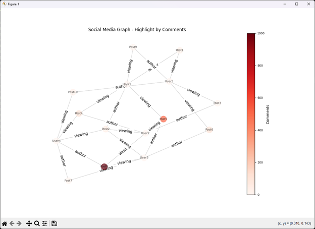

<div class="text-center p-4">
  
</div>

## ICS 311 Algorithms
This project was for the University of Hawai’i at Mānoa ICS 311 (Algorithms) course during the Summer 2024 term. ICS 311 is a course designed to teach students about the design and correctness of algorithms, including divide-and-conquer, greedy and dynamic programming methods. The course also aims to teach about complexity analyses using recurrence relations, probabilistic methods, NP-completeness, applications to order statistics, disjoint sets, B-trees and balanced trees, graphs, network flows, and string matching.

## Project Requirements
For this assignment, I needed to analyze social media data by implementing methods using current social media information to identify “interesting” clusters of content, clusters of users, and directional trends in how the networks are used. The assignment required me to produce a two- or three-dimensional diagram of the social media data, showing posts and users  as nodes, connected by edges corresponding to authorship or viewing. The diagram needed to highlight the most important posts. The diagram needed to show all posts, but visibly highlight important posts in some manner. The importance of posts could be categorized by the number of comments, number of views, or a blend of both. The diagram needed to be produced efficiently, and had to efficiently change its configuration depending on which importance criteria were chosen by an analyst using the diagram.

## Project Solution
The algorithm I developed used NetworkX and Matplotlib to create and visualize a social media network graph. The algorithm allowed the addition of nodes and edges to represent users and posts and their interactions, respectively. Nodes would be colored based on attributes such as comments or views, with color intensity reflecting the post's number of comments or views. The algorithm then generated visualizations using a spring layout (Force-Directed Graph Drawing) and included color legends to indicate the range of values for the selected criterion. Although Force-Directed Graph drawing has a high runtime, O(n3), it was used because it improves the readability of the graph. The `main` function took the information from the social media network and added nodes and edges, generated visualizations highlighting either comments or views and represented the data distribution within the network.

```
# Compute layout once
        if self.pos is None:
            self.pos = nx.spring_layout(self.graph, seed=42)  # Using a fixed seed for reproducibility

        node_colors = [self.get_node_color(node, criterion) for node in self.graph.nodes]

        fig, ax = plt.subplots(figsize=(12, 8))
        nx.draw(self.graph, pos=self.pos, with_labels=True, node_color=node_colors,
                node_size=300, font_size=8, font_color='black',
                edge_color='gray', linewidths=0.5, width=0.5, alpha=0.7, ax=ax)
```
## Example Output
<div class="text-center p-4">
  
</div>

## What I Learned
This project taught me how to develop an algorithm that could produce a computer-generated graph. The solution required me to learn how to use an algorithm to create a graph that could represent data in a way that could be easily read and could also be manipulated if need be. Through this project, I have been able to develop my ability to solve problems by developing and implementing algorithms that are designed to solve a specific problem and provide an efficient solution.

Source: <a href="https://github.com/jseto808/ICS311-SMG.git"><i class="large github icon "></i>jseto808/ICS311-SMG</a>
