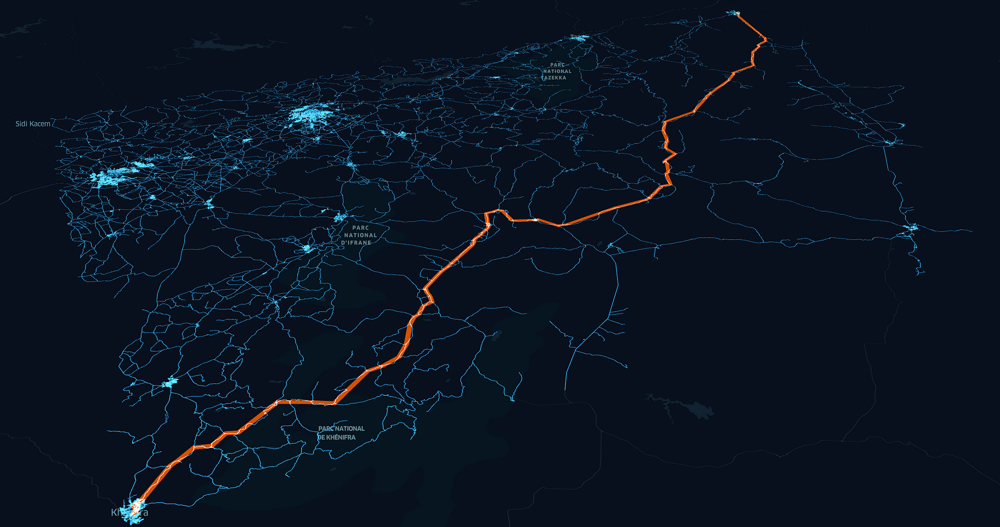

<div class="text-center p-4">
  
  
</div>

## ICS 311 Algorithms
This project was for the University of Hawai’i at Mānoa ICS 311 (Algorithms) course during the Summer 2024 term. ICS 311 is a course designed to teach students about the design and correctness of algorithms, including divide-and-conquer, greedy and dynamic programming methods. The course also aims to teach about complexity analyses using recurrence relations, probabilistic methods, NP-completeness, applications to order statistics, disjoint sets, B-trees and balanced trees, graphs, network flows, and string matching.

## Project Requirements
The project required me to find a solution to a problem that resembled the well-known Traveling Salesman Problem. I was required to develop and implement an algorithm for the distribution and circulation of resources across islands within the Polynesian Triangle. More specifically, I was to develop an algorithm that could ensure that skilled leaders could share their knowledge across the sea of islands. Leaders would want to share their knowledge with everyone in a hands-on way, so they needed to be able to visit as many islands in as short a time as possible. Leaders needed to repeat these trips, as the leaders themselves learned new skills, and as new people grew up and needed to learn the skills too. A single leader would use a single canoe to share their knowledge across the islands. The algorithm also needed to consider the recency of skill sharing by a leader and prioritize the highest populations.

## Project Solution
The algorithm I developed took the information from a graph of the Islands such as island travel times, population, and last visit time. It then used that information to assign priorities in the order of travel time, population, and recency. Dijkstra’s algorithm was then used to compute the shortest path to each island from the starting island with the priorities in mind. The shortest distances and shortest paths then recorded the paths found by Dijkstra’s algorithm to provide the answer to the shortest route and cost from the starting island to the destination. The algorithm could discover the best paths from each island to the next destination during a trip. Dijkstra’s algorithm was a good algorithm to use because it is a greedy algorithm that determines the shortest path possible with an average case time complexity of O((V + E) log V).

```
// Dijkstra's algorithm to find shortest paths from a single source
public static int[] dijkstra(int[][] graph, int start) {
    int n = graph.length;
    int[] dist = new int[n];
    Arrays.fill(dist, Integer.MAX_VALUE);
    dist[start] = 0;

    PriorityQueue<Integer> pq = new PriorityQueue<>(Comparator.comparingInt(v -> dist[v]));
    pq.offer(start);

    while (!pq.isEmpty()) {
        int u = pq.poll();

        for (int v = 0; v < n; v++) {
            if (graph[u][v] > 0 && dist[v] > dist[u] + graph[u][v]) {
                dist[v] = dist[u] + graph[u][v];
                pq.offer(v);
            }
        }
    }

    return dist;
}
```

## What I learned
This project helped me understand how to apply a special algorithm to my algorithm to solve a problem. I also learned how to solve a problem that could be applied to a real-world issue. The Traveling Salesman Problem is a problem that requires an efficient solution that can help minimize costs. This problem applies to real-world issues like simply finding the fastest way to get to work. Google Maps is a tool that uses a similar issue to find the fastest route from one point to another. Being able to solve the Traveling Salesman Problem taught me how a simple Computer Science solution can be extremely useful in a real application.

Source: <a href="https://github.com/jseto808/ICS311-TSP.git"><i class="large github icon "></i>jseto808/ICS311-TSP</a>
