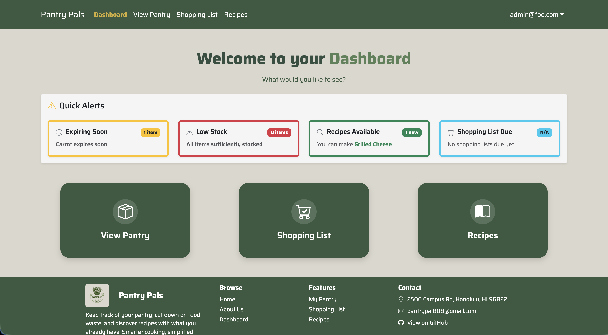
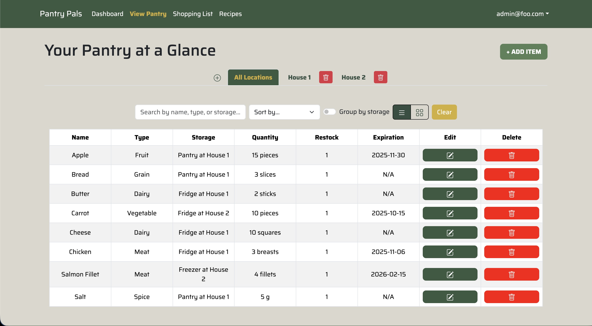
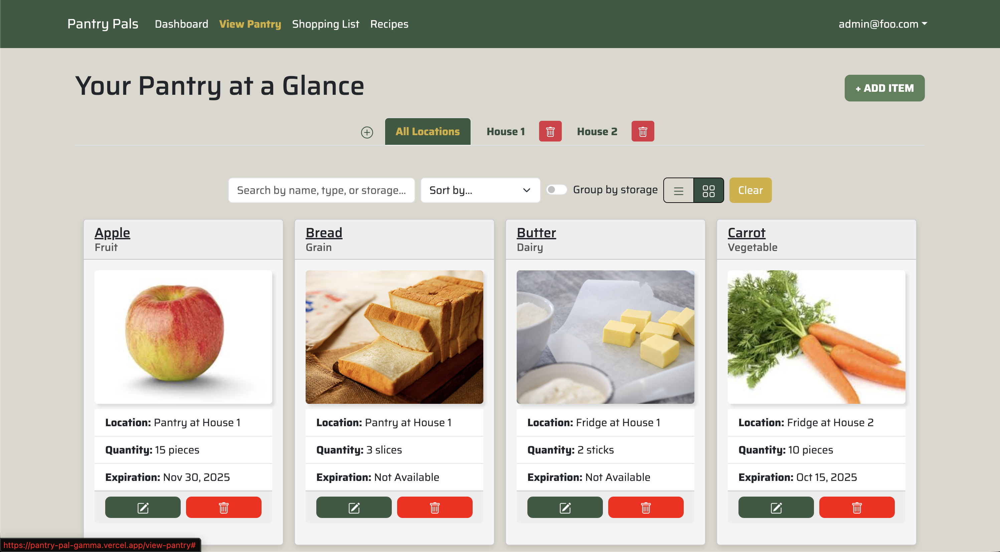
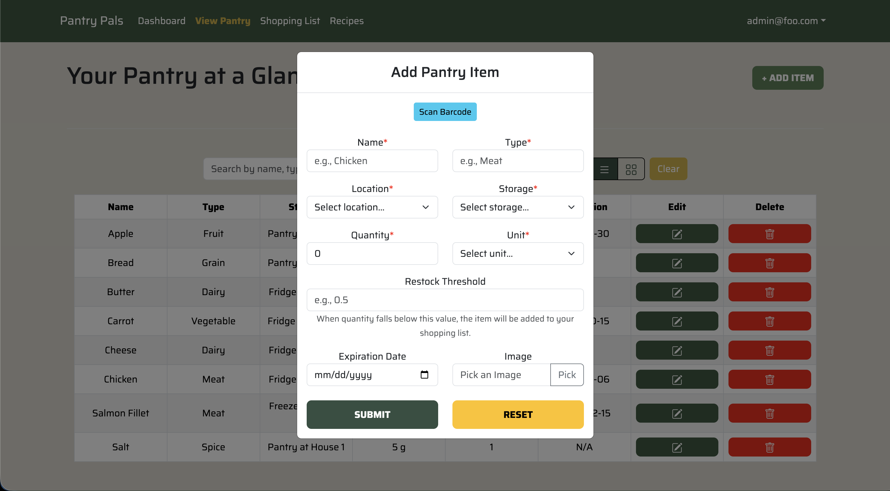
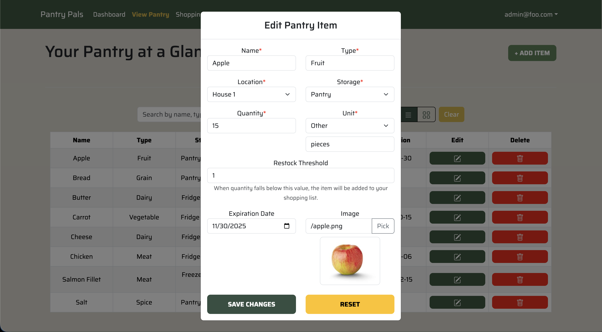
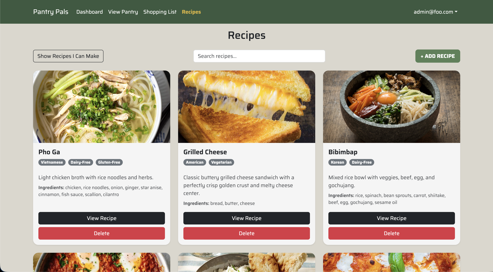
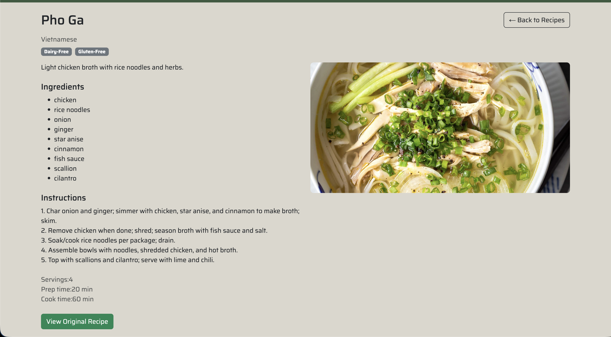
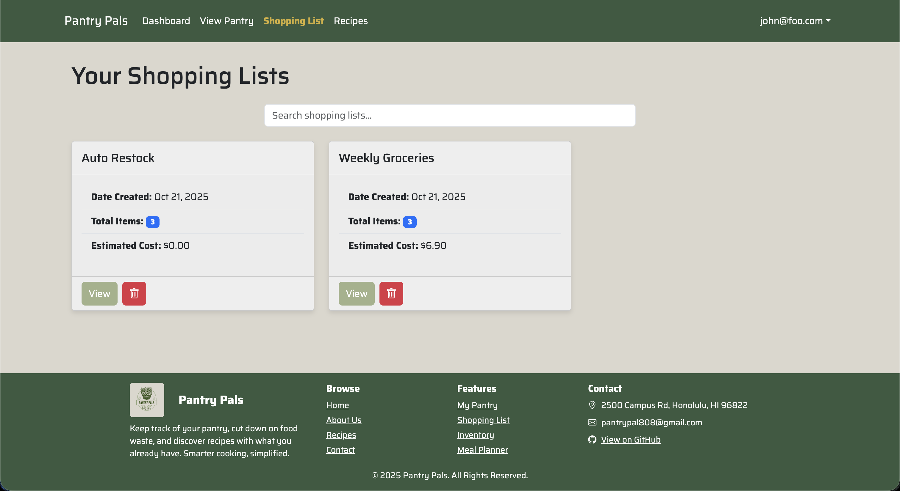
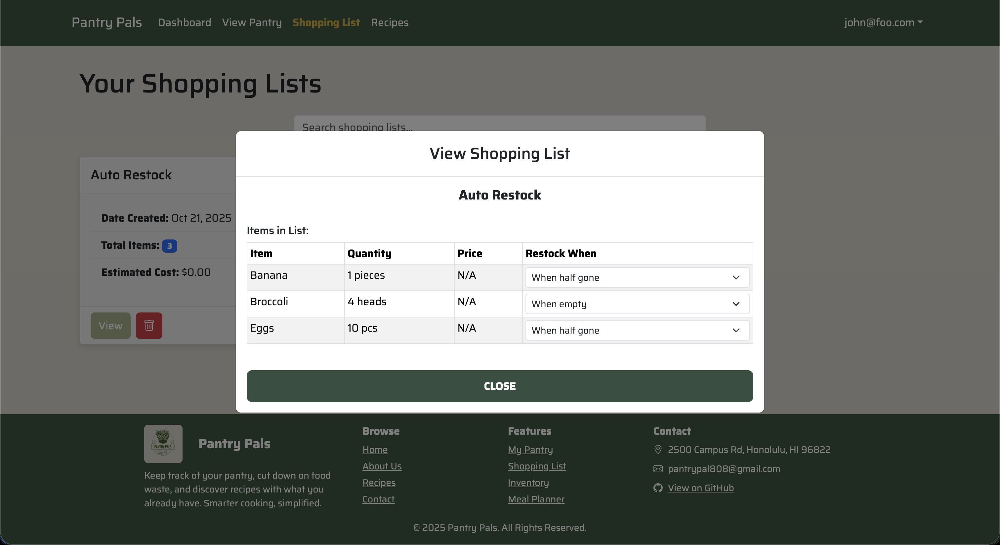

  

## Project Summary

Pantry Pal is a full-stack web application built with Next.js 14, TypeScript, PostgreSQL, and Prisma. It helps households reduce food waste by tracking pantry inventory with expiration dates and restock thresholds, automatically surfacing low-stock and expiring-soon alerts on a dashboard, managing multiple shopping lists, and filtering recipes based on what the user currently has on hand.

## My Contributions

### Pantry Item Management

I built the core produce management interface, including the add and edit modal flows, full CRUD operations, and the underlying API routes. The edit modal handles form state initialization from existing item data, unit selection, expiration date formatting, image attachment, and validation. I also added delete functionality with confirmation and wired up restock threshold tracking to the produce table.

  
  
  
  

I designed and implemented the Location and Storage data model — replacing the earlier flat "Stuff" model — and built the API endpoints and UI dropdowns that let users organize pantry items by where they are stored (e.g., fridge, freezer, pantry shelf). I refactored the pantry view into a `PantryClient` component to support client-side interactivity while keeping the page server-rendered.

### Recipe Ingredient System

I migrated the recipe data model from a plain text ingredients string to a structured `RecipeIngredient` join table, writing the migration, backfill script, and updated seed data. This unlocked the ability to compare recipe ingredients against the user's live pantry, which I implemented as ingredient highlighting in the recipe cards — items the user already has are visually distinguished from items they are missing.

  
  

### Shopping List

I added quantity and unit fields to shopping list items so users can record amounts alongside what they need to buy. I also added a checkbox column to the shopping list modal with persistent state, so checked items stay checked across modal open/close cycles within the session.

  
  

### Database and Infrastructure

I upgraded the project to Prisma v7 and updated the Prisma config to use the adapter-based client required by the new version. I wrote acceptance tests for the pantry view, shopping list page, and dashboard using Playwright and TestCafe, and maintained the CI workflow to run tests against Chromium headless.

## What I Learned

Pantry Pal was my first large-scale collaborative Next.js project. Working with 179 commits across a team taught me how to scope work into isolated branches, coordinate database migrations without breaking other contributors' work, and keep client and server components cleanly separated in the App Router model. Migrating the ingredient model mid-project reinforced the importance of thinking through data relationships early — the backfill script and migration were necessary but avoidable work. I also got hands-on experience with Prisma schema evolution and writing acceptance tests that run reliably in CI.

Source: <a href="https://github.com/pantry-pals/pantry-pal"><i class="large github icon"></i>pantry-pals/pantry-pal</a>
